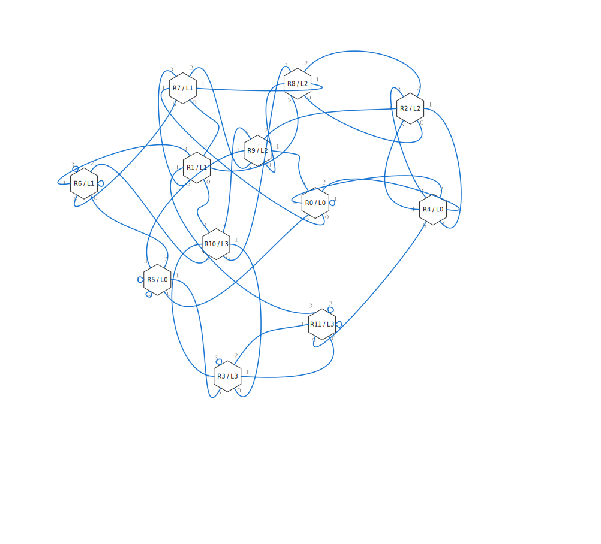
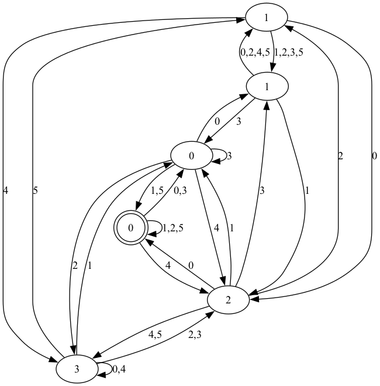

[](https://github.com/TeamSampou/icfpc2025/actions/workflows/haskell.yml)

# ICFP Programming Contest 2025

This is Team Sampou's repository for the [ICFP Programming Contest 2025](http://icfpcontest2025.github.io/).



## Members

* [Katsutoshi Itoh](https://github.com/cutsea110)
* [Kei Hibino](https://github.com/khibino)
* [Masahiro Sakai](https://github.com/msakai)
* [Nobuo Yamashita](https://github.com/nobsun)
* [Yasuyuki Ogawa](https://github.com/oganet)

## Languages

* Haskell

## Tools

* [Z3](https://github.com/Z3Prover/z3)

## Approaches

We employed several independent approaches.

### Random-walk + Constraint-solving

In this approach, we execute `/explore` with one or several random walks of the maximum permitted length, and then summarize the observation as a trie (see [src/ObservationSummary.hs](src/ObservationSummary.hs)) and solve a constraint satisfaction problem to synthesize a room layout that is consistent with the observation.

Initially, we explored the search space using backtracking (see `enumGraph` in [src/Graph.hs](src/Graph.hs)), but later we employed the SMT solver [Z3](https://github.com/Z3Prover/z3) (see [src/Graph/Z3.hs](src/Graph/Z3.hs)).

### Systematic exploration through repeated calls to `/explore`

Basically, we keep opening doors until we can identify a room with the target problem size.
Since we identify rooms by the patterns beyond the doors of the same room, we apply the same plan until we reach the target room.
After identifying the room, we perform a search to finalize the connections.
e.g. [src/LabelledBucket.hs](src/LabelledBucket.hs), [app/oga/Main.hs](app/oga/Main.hs)

## Usage

Prepare `.env` file with the following content:

```
ID="..."
```

### Manual solving

Run `stack repl`.

You can solve a problem interactively.

```
ghci> initClient
initClient
ghci> select "probatio"
"probatio"
ghci> explore ["000","123","213","333"]
([[0,1,2,0],[0,0,1,2],[0,1,1,2],[0,2,0,2]],5)
ghci> explore ["4","5","02","03","04","05","31","32","34","35"]
([[0,2],[0,2],[0,1,0],[0,1,2],[0,1,1],[0,1,0],[0,2,1],[0,2,0],[0,2,2],[0,2,1]],16)
ghci> guess ([0,1,2], 0, [((0,0),(1,2)), ((0,1),(0,1)), ((0,2),(1,5)), ((0,3),(2,0)), ((0,4),(2,2)), ((0,5),((2,3))), ((1,0),(2,1)), ((1,1),(1,4)), ((1,3), (2,5)), ((2,4),(2,4)), ((2,5),(1,3))])
True
```

### Constraint-solving approach using `enumGraphs`

```
ghci> :m +Control.Monad
ghci> :m +System.Random.MWC
ghci> initClient
ghci> select "primus"
ghci> let numRooms :: Int = 6
ghci> plan <- (withSystemRandom $ \gen -> randomWalk gen (maxPlan numRooms) :: IO Plan)
ghci> plan
"021320403505044123550520034431312210134541025332505010033554343013423011254052531011533004340304253205132534"
ghci> ([result],qc) <- explore [plan]
ghci> result
[0,0,3,0,0,3,3,3,3,2,3,3,1,2,3,3,0,3,2,3,1,2,3,2,0,0,0,2,3,2,0,0,0,0,0,0,0,0,0,2,3,3,0,1,1,1,0,0,3,1,2,3,3,0,1,1,1,0,0,0,2,1,1,1,1,1,0,2,1,1,1,1,2,1,1,1,2,3,2,3,2,0,1,2,0,0,0,0,1,1,3,2,3,3,2,0,2,1,1,0,3,3,1,1,0,3,1,1,1]
ghci> let t = ObservationSummary.fromObservation plan result
ghci> length $ Graph.enumGraph numRooms t
8
ghci> plan2 <- (withSystemRandom $ \gen -> randomWalk gen (maxPlan numRooms) :: IO Plan)
ghci> plan2
"444353015544011451142120542352352412021120333354143413534021124044433230143221233515203430144335244212214453"
ghci> ([result2],qc2) <- explore [plan2]
ghci> result2
[0,2,3,3,2,3,2,0,0,0,0,2,3,3,0,0,2,3,0,0,2,1,1,1,2,3,3,2,1,1,1,0,0,0,2,0,3,3,2,0,0,0,0,0,0,0,0,0,2,0,2,1,1,1,0,0,0,2,0,0,0,0,0,2,0,2,3,3,2,1,1,1,1,1,1,1,1,1,2,1,1,0,0,0,0,0,0,0,2,1,1,1,1,3,2,1,1,1,1,3,2,0,3,2,0,2,3,1,1]
ghci> let t2 = ObservationSummary.fromObservations [(plan,result), (plan2,result2)]
ghci> length $ Graph.enumGraph numRooms t2
1
ghci> Graph.writePng "example.png" $ head $ Graph.enumGraph numRooms t2
ghci> guess $ Graph.toLayout $ head $ Graph.enumGraph numRooms t2
True
```



### Constraint-solving approach using Z3

```
ghci> :m +Control.Monad
ghci> :m +System.Random.MWC
ghci> initClient
ghci> select "secundus"
ghci> let numRooms :: Int = 12
ghci> plans <- withSystemRandom $ \gen -> replicateM 2 (randomWalk gen (maxPlan numRooms) :: IO Plan)
ghci> (results,qc) <- explore plans
ghci> let t = ObservationSummary.fromObservations $ zip plans results
ghci> Just g <- Graph.Z3.findGraph numRooms t
ghci> guess $ Graph.toLayout g
True
```

### Systematic exploration 1

Run the command `oga-solve` with 2 arguments, (1) the problem name, and (2) the depth limit. The program systematically opens all doors by a depth-first approach.

```
$ stack run oga-solve1 zain 100
```

### Systematic exploration 2

(TBD)
